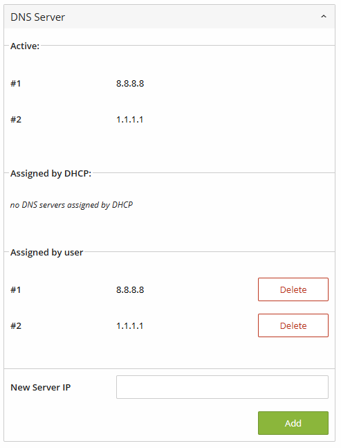
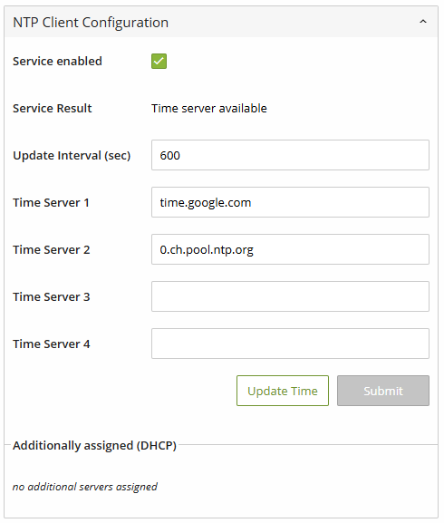
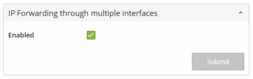
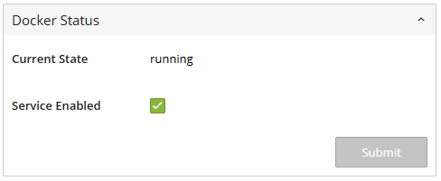
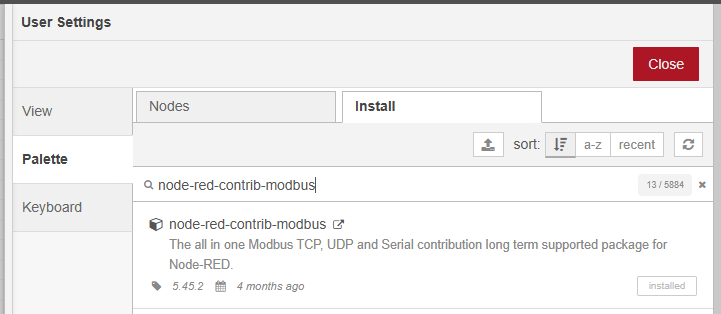

# PFC modbus-server & node-red demo application

Stéphane Rey</br>
07.04.2026</br>
</br>

<a id="contenttab"></a>
Table of content

1. [Documentation](#chapter1)</br>
2. [Installation](#chapter2)</br>
3. [Examples](#chapter3)</br>

</br>

<a id="chapter1"></a>
## 1. Documentation 

* Node-Red modbus contribution, tutorial video:</br>
https://stevesnoderedguide.com/modbus-writing-data

* Node-Red modbus contribution: `node-red-contrib-modbus`</br>
  https://flows.nodered.org/node/node-red-contrib-modbus

* WAGO fieldbus coupler manual 750-362</br>
  https://www.wago.com/wagoweb/documentation/750/eng_manu/coupler_controller/m07500362_xxxxxxxx_0en.pdf

* WAGO serial interface manual 750-1652</br>
  https://www.wago.com/wagoweb/documentation/750/ger_manu/modules/m07501652_00000000_0de.pdf

* WAGO IO-System product documentation</br>
  https://www.wago.com/wagoweb/documentation/index_d.htm

</br>

[<div style="text-align: center;"><span style="font-size: 12px;">back</span></div>](#contenttab)

<a id="chapter2"></a>
## 2. Installation

### 2.1 Connect the Controller to the Internet

Login the Web Based Management (WBM)

> Set a valid DNS-server


</br></br>

> Set a valid time server (NTP-server)


</br></br>

> Activate IP Forwarding through multiple interfaces</br>


</br></br>

> Make sure the Domaine names are correctly solve</br>

```
ping google.com
```

</br>

> Enables the controller to run Docker containers</br>


</br></br>

#### 2.1.1 Important

> make sure the RUN-STOP-RESET button is switch to the RUN position
  * Onboard operating switch: 
    * START = modbusserver is running 
    * STOP modbusserver is stopped

> if the communication doesn't work properly
  * If the kbus would not init: => stop container => activate runtime => deactivate runtime => start container
    (This inits the kbus via runtime thread, watch kbus led: must be green)

</br></br>

### 2.2 Download and start "modbus server" Docker container

https://hub.docker.com/r/wagoautomation/pfc-modbus-server

*the container is downloaded automaticly:*
```
docker run -d \
--init \
--restart unless-stopped \
--privileged \
-p 502:502 \
--name=pfc-modbus-server \
-v /var/run/dbus/system_bus_socket:/var/run/dbus/system_bus_socket \
wagoautomation/pfc-modbus-server 
```

*Make sure to use original WAGO `armV7` images becouse the PFC200 have less memory capacity*

</br></br>

### 2.3 Download and start "node-red" Docker container

https://hub.docker.com/r/wagoautomation/node-red-cc100

*the container is downloaded automaticly*
```
docker run -d --name wago-node-red \
--restart unless-stopped \
-d --privileged=true --user=root \
-p 1880:1880 \
-v node_red_user_data:/data \
wagoautomation/node-red-cc100:1.0.0

```

*Make sure to use original WAGO `armV7` images becouse the PFC200 have less memory capacity*

</br></br>

### 2.4 install the node-red-contrib-modbus contribution

if necessery install node-red-contrib-modbus :
> `ALT+SHIFT+P` or `manage palette` menu:


</br></br>


[<div style="text-align: center;"><span style="font-size: 12px;">back</span></div>](#contenttab)

<a id="chapter3"></a>
## 3. Examples

Somme Node-RED flows are available here:

The PLC configuration contains
| Slot # | part number | modul count  | config   |
|:------:|:------------|:------------:|:--------:|
| 0      | 750-8212    | 1            | -        |
| 1      | 750-402     | 1            | -        |
| 2-4    | 750-1504    | 3            | -        |
| 5      | 750-1652    | 1            | 24-bytes |
| 6      | 750-600     | 1            | -        |
|        |             |              |          |

</br>

> example 1:</br>
`./flows/example1/flows.json`</br>
> wago-pfc-modbus-server:</br>
  ->  read the K-Bus configuration</br>
  ->  read/write digital inputs and outputs</br>
  ->  read/write serial interface status & control byte, send a simple ASCII string</br>

> example 2:  
`./flows/example2/flows.json`</br>
> with CODESYS Modbus server (gebuging plc application)</br>
  ->  read/write digital inputs and outputs</br>
  ->  serial echo application, return all received ASCII char back</br>

> example 3:  
`./flows/example3/flows.json`</br>
> wago-pfc-modbus-server rolled out as Docker stack over the solution platform:</br>
  ->  read the K-Bus configuration</br>
  ->  read/write digital inputs and outputs</br>
  ->  serial echo application, return all received ASCII char back</br>

</br>

### 3.1 Import the flows in the Node-red environement

* Open the Node-red UI within a Browser:</br>
  http://192.168.1.17:1880

  *the Container doesn't support HTTPs encrypted communication*


</br>

 ### 3.2. Deployement with the WAGO Solution Platform

docker-compose.yml for deployement over the WAGO solution platform
```
version: "3.8"

services:
  wago-node-red:
    image: wagoautomation/node-red-cc100:1.0.0
    container_name: wago-node-red
    restart: unless-stopped
    privileged: true
    user: root
    ports:
      - "1880:1880"
    volumes:
      - node_red_user_data:/data

  pfc-modbus-server:
    image: wagoautomation/pfc-modbus-server
    container_name: pfc-modbus-server
    restart: unless-stopped
    privileged: true
    init: true
    ports:
      - "502:502"
    volumes:
      - /var/run/dbus/system_bus_socket:/var/run/dbus/system_bus_socket

volumes:
  node_red_user_data:
```

[<div style="text-align: center;"><span style="font-size: 12px;">back</span></div>](#contenttab)